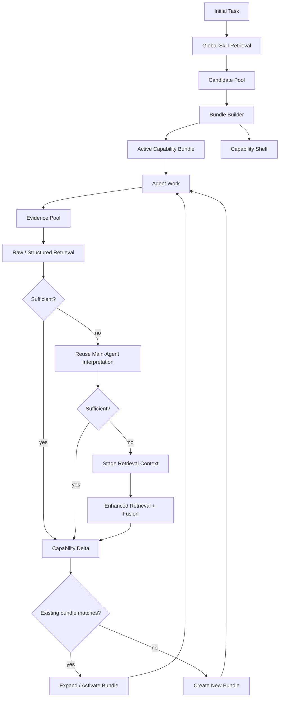

# Architecture V0.2 — Stage Capability Bundles

## Goal

V0.2 changes runtime routing from fine-grained Skill switching into **stage-batched capability loading**.

> Retrieve a high-recall candidate set, keep a compact Capability Shelf, activate a useful Bundle for the current stage, and expand the working set only when runtime evidence reveals a missing capability.

Existing raw-retrieval diagnostics remain as baselines.

## Runtime flow



## Evidence Pool

Runtime evidence is open-set, so V0.2 does not build a universal evidence preprocessor.

The Evidence Pool contains:

- raw runtime outputs: stderr, tracebacks, test results and tool outputs;
- structured signals: exit codes, HTTP status and explicit error types;
- main-Agent interpretation already produced during normal reasoning.

The third source matters because its semantic reasoning cost has already been paid.

## Retrieval sufficiency, not evidence simplicity

The escalation question is not whether evidence looks simple. It is whether the current evidence representation already retrieves a stable and useful capability candidate.

```text
raw + structured evidence
        |
        v
direct retrieval
        |
   sufficient?
    /      \
 yes       no
 |          |
use     add Agent interpretation
            |
       sufficient?
        /      \
      yes       no
      |          |
     use       SRC enhancer
```

No universal threshold is hard-coded. A harness must supply a sufficiency policy calibrated from Gold data.

## Stage Retrieval Context

**Stage Retrieval Context (SRC)** is a retrieval-oriented semantic expansion used only after cheaper paths fail.

Example:

```text
Evidence:
tests fail only in CI after cache restore

SRC:
CI cache contamination, environment isolation,
and nondeterministic test diagnosis
```

SRC is **not** root-cause diagnosis and does not generate Bundles. Its only job is to make the missing capability easier to retrieve.

The implemented escalation order is:

1. raw + structured evidence;
2. raw + structured + existing main-Agent interpretation;
3. optional SRC enhancer.

At step 3, SRC retrieval is fused with earlier evidence rankings so a bad semantic expansion does not erase the original evidence signal.

The enhancer is a protocol, not a hard-wired provider. It may later be backed by a general LLM, but Bundle logic does not depend on any specific model API.

## Capability Shelf and Active Bundle

A retrieval pass may discover several useful capability directions without loading every Skill body.

```text
Active
- CI & Test Debugging
  - pytest-debugging
  - github-actions
  - flaky-test-debugging

Shelf
- Runtime & Dependencies
- Repository Inspection
- Container Environment
```

The **Active Bundle** is the current stage working set.

The **Capability Shelf** keeps compact descriptors for other capability groups discovered in the same retrieval pass, so the main Agent can recognize a later capability gap without paying the cost of loading every Skill body.

## Bundle generation

A Bundle is a runtime working set, not a permanent taxonomy.

```text
BM25 Top-K union Dense Top-K
        |
        v
Candidate Pool
        |
        v
Bundle Builder
        |
        +-- Active Bundle
        |
        +-- Capability Shelf
```

The current deterministic baseline groups by:

1. Skill category;
2. otherwise explicit tag;
3. otherwise per-Skill fallback.

Retrieval rank is preserved inside each group. This is intentionally replaceable by embedding clustering, MMR or learned bundle selection after the baseline is measured.

## Evidence-driven expansion

New evidence still searches the **global Skill registry**.

```text
new evidence
    |
    v
selective retrieval escalation
    |
    v
candidate delta
    |
    +-- existing capability group --> expand / activate Bundle
    |
    +-- new capability group --> create Bundle
```

Existing capabilities are not automatically deleted.

Default V0.2 policy:

```text
RegisteredSkills(t) subseteq RegisteredSkills(t+1)
```

A later context policy may mark old Bundles dormant without forgetting them.

## Context and cache policy

V0.2 separates three surfaces:

| Surface | Content | Lifetime |
|---|---|---|
| Registry | all compact Skill metadata | session/global |
| Capability Shelf | compact Bundle descriptors | stable across a stage |
| Skill body | full SKILL.md and references | progressive, on demand |

The system prefers a few coarse capability-surface changes over constant per-Skill mutation.

A stage therefore behaves like a cache-friendly context epoch: expand once when a real capability gap appears, then keep the surface stable for multiple turns.

## Initial task versus runtime evidence

The initial task is not required inside every capability-discovery query.

Responsibilities are separated:

- **Evidence / SRC** discovers the missing capability.
- **Initial task + current stage** performs task alignment and decides whether the candidate is worth adding.

The old `initial_task + raw_evidence` query remains a benchmark baseline for measuring anchoring effects.

## Runtime state

Minimum runtime state:

```text
EvidencePool
CapabilityShelf
Active bundle ids
Registered Skill ids
Retrieval traces
```

Each retrieval trace records:

- phase: raw / agent-augmented / SRC-enhanced;
- query text;
- returned candidates;
- whether the configured sufficiency policy accepted the result.

This makes semantic-cost escalation measurable rather than implicit.

## Current implementation

Implemented on the V0.2 feature branch:

- EvidencePool with separate raw and Agent-augmented retrieval surfaces;
- CapabilityShelf / CapabilityBundle;
- deterministic Bundle grouping baseline;
- monotonic retrieval-delta integration;
- selective stage retrieval escalation;
- SRC enhancer protocol;
- raw/evidence ranking fusion for SRC fallback;
- Bundle trajectory metrics;
- escalation metrics:
  - raw resolution rate;
  - Agent-reuse rate;
  - SRC escalation rate.

## Next experiments

1. Run the Hermes stage-transition Gold through the Bundle trajectory evaluator.
2. Calibrate retrieval-sufficiency policies from target ranks / agreement signals.
3. Measure how often Agent reasoning avoids SRC.
4. Add a real general-LLM SRC provider only after the above baseline is measured.
5. Compare metadata Bundle grouping with embedding/MMR grouping.
6. Measure token/cache cost under per-Skill loading vs stage-batched loading.

## Non-goals

- universal evidence ontology;
- root-cause diagnosis inside the control plane;
- permanent hand-designed Skill taxonomy;
- learned grouping before a deterministic baseline exists;
- automatic destructive unloading;
- a mandatory LLM call on every transition.
