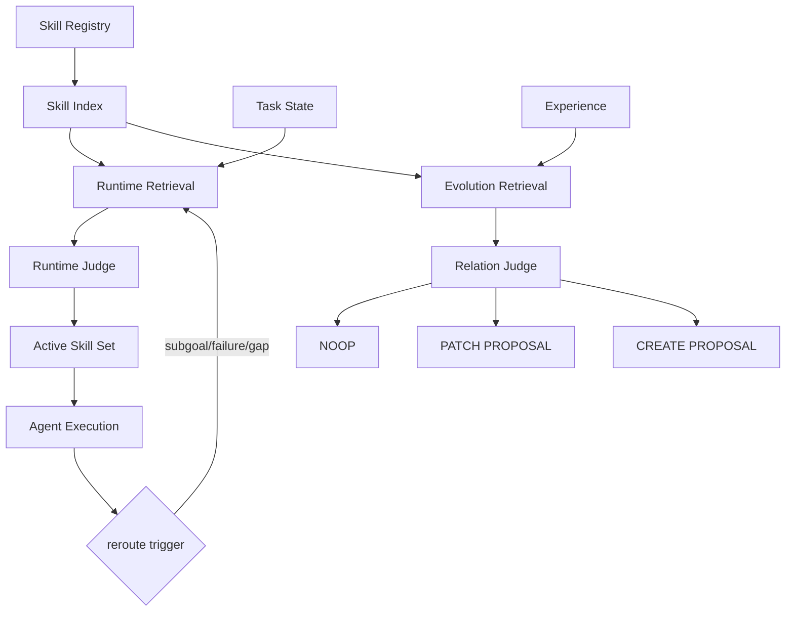

# Architecture V0.1

> **Historical / eval-only.** This document preserves evidence or an earlier design; it is not authoritative for the V1 runtime.

## Problem

A growing Skill library creates two control problems:

1. **Runtime:** which Skills should be active for the current task state, and when should routing be revisited?
2. **Evolution:** when a new experience is learned, should it be ignored, added to an existing Skill, or become a new Skill?

V0.1 treats these as two decisions over a shared registry and retrieval layer.

## Core principle

> Deterministic retrieval is a high-recall evidence generator. It narrows the search space; it does not own the final semantic decision.

The LLM judge consumes a small candidate set plus retrieval evidence and returns an explainable decision.

## Data flow

## Progressive loading

V0.1 distinguishes three surfaces:

1. **Registry/index:** compact searchable representation.
2. **Candidate evidence:** only Top-K metadata/evidence reaches the judge.
3. **Active Skill content:** full SKILL.md or referenced files are loaded only after activation.

Progressive loading solves per-Skill context growth. Retrieval solves library-scale growth.

## Runtime rerouting

The initial retrieval result is a hypothesis, not a lock.

V0.1 supports only:

- subgoal transition
- execution failure
- explicit capability gap

## Evolution preflight

| Relation | Meaning | V0.1 action |
|---|---|---|
| COVERED | Existing Skill already contains the lesson | NOOP |
| REFINES | Lesson corrects or sharpens existing guidance | PATCH_PROPOSAL |
| EXTENDS | Lesson adds a new case to the same capability | PATCH_PROPOSAL |
| NOVEL | No existing Skill can reasonably host it | CREATE_PROPOSAL |

No automatic mutation is performed in V0.1.

## Explicit non-goals

- automatic merge/split
- contradiction or supersession resolution
- archive/delete lifecycle
- Skill hierarchy construction
- multi-Skill DAG planning
- marketplace or remote registry
- trained retriever
